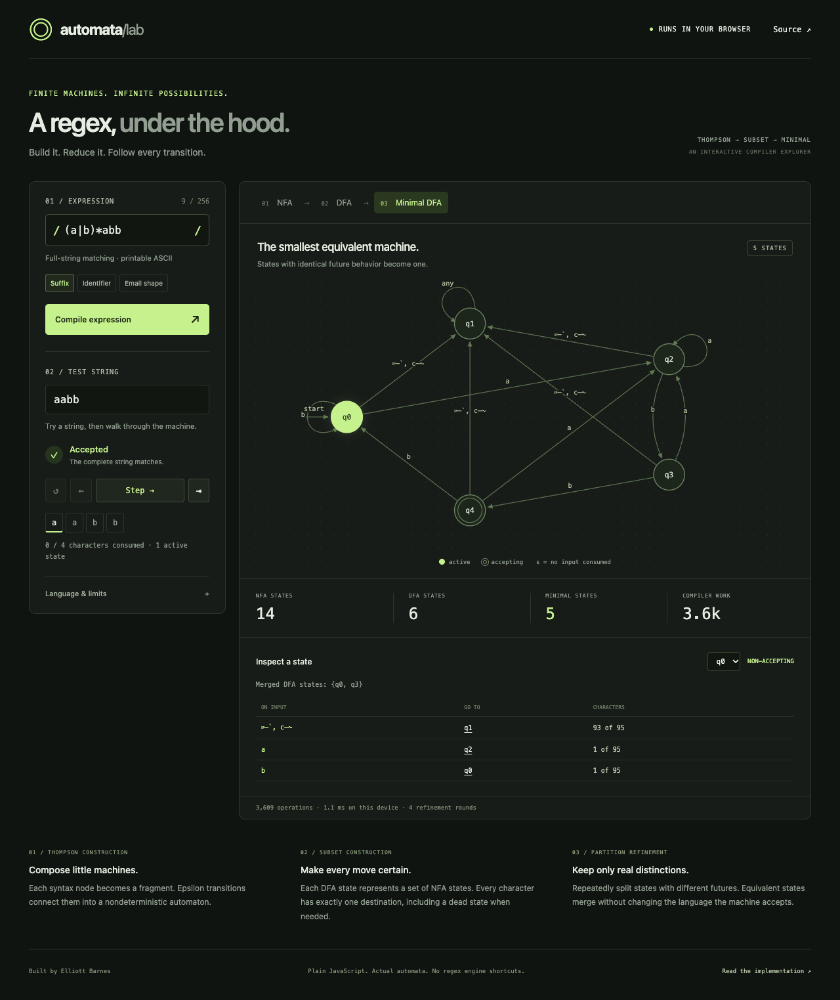

# Automata Lab

An inspectable regular expression compiler. Write an expression, follow its transformation into three equivalent machines, and step through a full-string match one character at a time.

**[Open the interactive lab](https://elliottbarnes.github.io/automata-lab/)**



The compiler implements parsing, Thompson construction, subset construction, and DFA minimization in plain JavaScript. The production engine never calls JavaScript's `RegExp`; native regex is used only as an independent reference in tests. There are no runtime dependencies, backend services, accounts, or build steps.

## Contents

- [Quick start](#quick-start)
- [Explore the interface](#explore-the-interface)
- [Use the engine directly](#use-the-engine-directly)
- [Worked example: recognizing a suffix](#worked-example-recognizing-a-suffix)
- [Grammar and matching semantics](#grammar-and-matching-semantics)
- [Algorithms and representation](#algorithms-and-representation)
- [Metrics and resource bounds](#metrics-and-resource-bounds)
- [Verification](#verification)
- [Source map](#source-map)
- [Troubleshooting](#troubleshooting)
- [Contributing and extending the compiler](#contributing-and-extending-the-compiler)
- [License](#license)

## Quick start

Use Node.js **24 or newer** for the engine examples and tests, and Python **3** for the included development-server command. The browser demo needs a modern browser with ES modules, module Web Workers, and SVG support.

```sh
git clone https://github.com/elliottbarnes/automata-lab.git
cd automata-lab
node --version
python3 --version
npm test
npm run serve
```

Open **http://localhost:4175**. Stop the server with **Ctrl+C**. No `npm install` is required: `npm` runs the scripts in `package.json`, and the tests use Node's built-in test runner.

The server serves only `docs/`. It is a development server, not a production server. For a localhost-only listener, use this command instead of `npm run serve`:

```sh
python3 -m http.server 4175 --bind 127.0.0.1 --directory docs
```

Serve the demo over HTTP or HTTPS. Opening `docs/index.html` directly with a `file://` URL can prevent the modules and compilation worker from loading.

## Explore the interface

1. Start with the **Suffix** preset, `(a|b)*abb`, and input `aabb`.
2. Select **NFA**, **DFA**, or **Minimal DFA** to inspect that compilation stage. State numbers belong to their stage; `q2` in the NFA need not mean the same thing as `q2` in the minimal DFA.
3. Press **Step** to consume one character. The highlighted states show the current configuration. **Reset**, **Previous**, and **Jump to result** move through the same trace.
4. Select a node, choose a state from **Inspect a state**, or follow a transition-table destination. The inspector shows its origin and every outgoing transition.
5. Change the input to `abab` to see rejection. Change the expression and press **Compile expression** to build a different machine.

The **Accepted/Rejected** verdict describes the complete input, even while the step controls show an earlier configuration. A double circle marks an accepting state, and `ε` labels a transition that consumes no input. In labels, `␠` represents a space and `any` represents all 95 characters in the supported alphabet.

Editing the expression leaves the last compiled machine visible until compilation succeeds. A failed compilation displays an error and identifies the last valid expression. Input edits update the trace immediately. The Identifier and Email shape presets demonstrate character classes; **Email shape is an illustrative language, not an email-address validator**.

Compilation runs in a disposable worker. Starting another compilation cancels the preceding worker. The compiler does not transmit expressions or test strings to a backend, and the demo does not persist edits across page reloads.

## Use the engine directly

Run this from the repository root. It imports the same module used by the browser, without starting a server:

```sh
node --input-type=module <<'JS'
import { compile, trace } from './docs/engine.js';

const result = compile('(a|b)*abb');
console.log(JSON.stringify({
  nfa: result.nfa.states.length,
  dfa: result.dfa.states.length,
  minimal: result.min.states.length,
}));

for (const kind of ['nfa', 'dfa', 'min']) {
  const run = trace(result[kind], 'aabb');
  console.log(`${kind}: accepted=${run.accepted}, frames=${run.frames.length}`);
}

const run = trace(result.min, 'aabb');
console.log(run.frames.map(frame => `q${frame.active[0]}`).join(' -> '));
console.log(`abab accepted: ${trace(result.min, 'abab').accepted}`);
console.log(`operations=${result.operations}, rounds=${result.min.rounds}`);
JS
```

Expected output for the current implementation:

```text
{"nfa":14,"dfa":6,"minimal":5}
nfa: accepted=true, frames=5
dfa: accepted=true, frames=5
min: accepted=true, frames=5
q0 -> q2 -> q2 -> q3 -> q4
abab accepted: false
operations=3609, rounds=4
```

State numbering and the operation count describe this implementation, not the language's mathematical definition. They can change after a compiler refactor while acceptance remains identical.

### Exported API

| Export | Contract |
| --- | --- |
| `compile(pattern)` | Returns `{ pattern, ast, nfa, dfa, min, operations }`, or throws `CompileError`. |
| `parse(pattern)` | Returns the syntax tree without constructing machines. |
| `trace(machine, input)` | Returns `{ accepted, frames }`. Pass an unmodified `nfa`, `dfa`, or `min` from `compile`. |
| `graphEdges(machine)` | Returns `{ from, to, chars }` edges; DFA characters with the same destination are grouped. `chars: null` denotes epsilon. |
| `labelChars(chars, maxLength)` | Formats a character set for display; long labels can become a character count. |
| `ALPHABET` | The ordered array of 95 printable ASCII characters. Treat it as read-only. |
| `LIMITS` | The frozen pattern, input, NFA, DFA, and compilation-work limits. |
| `CompileError` | Error class with a message and an optional zero-based source `offset`; the offset is `null` when unavailable. |

A trace always includes frame zero before any character is consumed. Each frame has `{ index, symbol, active, accept }`: `index` is the number of consumed characters, `symbol` is the character just consumed (`null` initially), `active` contains the current state IDs, and `accept` indicates whether stopping at that frame would accept. NFA frames include the epsilon closure; deterministic frames contain one state. Final `accepted` equals the last frame's `accept`.

The API is synchronous. The browser wraps compilation in a worker; importing `compile` directly does not create a worker or apply the UI's wall-clock watchdog. Treat returned machines as inspection data: `trace` does not validate arbitrarily edited machine structures.

## Worked example: recognizing a suffix

The expression **`(a|b)*abb`** recognizes strings made entirely of `a` and `b` that end in `abb`.

| Input | Result | Reason |
| --- | --- | --- |
| `abb` | Accept | The repeated prefix can be empty. |
| `aabb` | Accept | Prefix `a`, followed by `abb`. |
| `ababb` | Accept | Prefix `ab`, followed by `abb`. |
| `abab` | Reject | Does not end in `abb`. |
| `cabb` | Reject | `c` is not permitted by the expression. |
| empty string | Reject | The required suffix is missing. |

### From 14 NFA states to 6 DFA states

Each literal becomes a two-state fragment. The `a|b` alternative adds entry and exit states around its two branches; `*` adds another entry and exit. That gives eight states for `(a|b)*`, plus six for the three suffix literals: **14 NFA states**.

The NFA can be in multiple states at once. Before reading input, its epsilon closure is `{q0, q1, q2, q4, q6, q8}`. Subset construction treats that entire set as one DFA state. It discovers **6 reachable DFA states**, including the empty subset, which becomes a rejecting dead state.

### From 6 DFA states to 5 minimal states

Two DFA states, `q0` and `q3`, have different NFA subsets but accept exactly the same possible future suffixes. Partition refinement merges them. The result has **5 states**:

| Minimal state | Meaning | On `a` | On `b` | On any other printable ASCII character | Accepting? |
| --- | --- | --- | --- | --- | --- |
| `q0` | No nonempty prefix of `abb` is the current suffix | `q2` | `q0` | `q1` | No |
| `q1` | Dead state: an invalid character was consumed | `q1` | `q1` | `q1` | No |
| `q2` | Current suffix is `a` | `q2` | `q3` | `q1` | No |
| `q3` | Current suffix is `ab` | `q2` | `q4` | `q1` | No |
| `q4` | Current suffix is `abb` | `q2` | `q0` | `q1` | Yes |

The alphabet matters: a textbook machine defined only over `{a,b}` can use four states. This lab defines a **total** DFA over all printable ASCII, so it includes a fifth state to reject the other 93 characters. A total DFA has a destination for every state-and-character pair.

For `aabb`, the minimal trace is:

```text
consumed:   nothing   a     a     b     b
state:      q0   ->  q2 -> q2 -> q3 -> q4
accepting:  no       no    no    no    yes
```

The current compiler reports **3,609 budgeted operations** and **4 refinement rounds** for this expression. The rounds include the final pass that confirms the partition no longer changes. Timing varies by device and is not an expected-output assertion.

## Grammar and matching semantics

```text
expression  := sequence ("|" sequence)*
sequence    := repetition*
repetition  := atom ("*" | "+" | "?")?
atom        := literal | escaped-punctuation | "."
             | "(" expression ")" | character-class
character-class := "[" "^"? class-item+ "]"
class-item  := class-character | class-character "-" class-character
```

This is a compact grammar; class-edge hyphens and escapes follow the rules below.

- **Alphabet:** space (U+0020) through tilde (U+007E), inclusive. Both patterns and inputs reject control characters and non-ASCII characters. Spaces are significant; whitespace is not skipped.
- **Precedence:** repetition binds most tightly, concatenation next, and alternation last. Thus `ab|c` means `(ab)|c`.
- **Full-string matching:** the entire input must be consumed successfully. Enter the expression directly, without surrounding `/` delimiters or `^`/`$` anchors. A slash is an ordinary character here.
- **Repetition:** `*`, `+`, and `?` mean zero-or-more, one-or-more, and optional. These define accepted languages; there is no capture extraction or greedy/lazy ordering.
- **Dot and complement:** `.` matches any character in the supported alphabet; `[^a]` matches any supported character except `a`.
- **Classes:** ranges such as `[a-z]` are inclusive. `[a-zA-Z_]` unions ranges and literals. Ranges must run forwards. A hyphen at a class edge is literal; `\-` also works. Escape literal `[` and `]` inside a class.
- **Escapes:** backslash can escape exactly `(`, `)`, `[`, `]`, `|`, `*`, `+`, `?`, `.`, `\`, `^`, `$`, `{`, `}`, `-`, and `/`. For example, `\.` matches a dot. JavaScript string literals need their own escaping: `compile('\\.')` passes that regex to the engine.
- **Empty language versus empty string:** an empty expression, `()`, or an empty alternative matches the empty string. `[]` and `[^]` are rejected. `[^ -~]` is valid but matches no character because it excludes the whole supported alphabet; it therefore accepts no strings by itself.

Unsupported features are rejected explicitly: Unicode, flags, anchors, shorthand classes such as `\d`/`\w`/`\s`, counted repetition, backreferences, lookaround, special groups such as `(?:...)`, and stacked or lazy quantifiers. A group is solely a grouping construct, not a numbered capture.

## Algorithms and representation

### 1. Recursive-descent parser

`parse` implements alternation, sequence, repetition, and atom parsing. Its syntax tree uses `chars`, `empty`, `sequence`, `alt`, `*`, `+`, and `?` node types. Character classes are expanded into explicit character arrays, which keeps later passes independent of class syntax.

### 2. Thompson NFA construction

`thompson` recursively returns fragments with a start and an end. Concatenation connects neighboring fragments with epsilon edges; alternation branches and rejoins; repetition adds bypasses or back edges. The completed NFA marks its final state as accepting.

An NFA state is `{ id, accept, edges }`, where each edge is `{ to, chars }`. A `null` character set means epsilon. `closure` follows epsilon edges until no new states are reachable, using a visited set to terminate even when nullable repetitions create cycles.

Construction is linear in the expanded syntax representation. It makes the relationship between syntax and state fragments easy to inspect, at the cost of epsilon edges and extra states.

### 3. Subset construction

`determinize` starts from the initial epsilon closure. For each current subset and character class, it follows consuming edges, closes the destinations over epsilon, and interns the sorted destination set. Only reachable subsets are generated.

Alphabet classes group characters whose membership is identical across every consuming NFA edge. One representative suffices for computing the destination, but the resulting transition table still records all 95 individual characters. A DFA state is `{ id, members, accept, transitions }`; its `members` are NFA IDs, and `transitions[character]` is a DFA ID.

With `N` NFA states, subset construction can require up to `2^N` DFA states in the worst case. Grouping characters avoids repeated work but does not remove this exponential bound. The compiler stops with an error when a resource limit is reached.

### 4. Moore partition refinement

`minimize` initially separates accepting from non-accepting states. Within each group, it compares the destination-group signature for every alphabet character. Different signatures split the group. Refinement repeats until there are no new groups.

Each final group becomes one state. The result is numbered by breadth-first traversal from the initial group; its `members` are **DFA IDs**, rather than NFA IDs. All states are reachable because the input DFA was reachable.

For `D` DFA states and alphabet size `A`, Moore refinement has an `O(A × D²)` worst-case bound under a unit-cost transition model. Hopcroft's algorithm can achieve `O(A × D log D)`, but Moore refinement is smaller and easier to inspect within the lab's 128-state limit. The implementation does not claim the faster algorithm.

### 5. Matching and graph projection

`trace` advances the NFA state set or the deterministic state once per input character. Deterministic matching takes linear time in input length once the machine is built; retaining every frame also uses memory proportional to input length. NFA traces retain a set of active states per frame.

`graphEdges` groups deterministic transitions by destination for the display. That does not change the transition table or semantics. Display labels may be shortened; use the state's transition table to inspect its outgoing character groups.

## Metrics and resource bounds

| Metric | Meaning |
| --- | --- |
| NFA/DFA/minimal state counts | Actual sizes of the three machine representations, including reachable dead states. |
| Compiler work | Instrumented construction, closure, subset, and refinement operations. It is not a CPU instruction count. |
| Compilation duration | Time spent in `compile` inside the worker on the current device; excludes worker startup, message transfer, and UI rendering. |
| Refinement rounds | Moore-refinement passes, including the final stable pass. |

| Bound | Value | Enforcement |
| --- | --- | --- |
| Pattern length | 256 ASCII characters | Parser |
| Input length | 512 ASCII characters | Trace API |
| Thompson NFA | 512 states | NFA construction |
| Reachable DFA | 128 states | Subset construction |
| Budgeted compilation operations | 2,000,000 | Instrumented compiler operations |
| UI compilation watchdog | 4 seconds | Main thread terminates the worker |
| Diagram nodes | 24 at once | Display only |

State and work limits are deterministic for an expression and implementation. The watchdog is an additional device-dependent limit, not a substitute for those bounds. Exceeding a compiler limit rejects the build; it never returns a silently truncated machine.

A machine with more than 24 states switches to a selected-state neighborhood and reports how many states are shown. Every state remains selectable, and the outgoing transition table stays complete, including destinations outside the visible neighborhood. Circular SVG layout is intentionally simple; dense diagrams can overlap. Diagram size is not a compiler limit.

Minimization reduces the number of states when equivalent states exist. It does not guarantee a reduction for every expression, or a runtime speedup. Neither the operation metric nor the displayed timing is a cross-project benchmark.

## Verification

```sh
npm test
```

The current suite contains **22 passing tests**. It checks more than the compiler's own stages agreeing with each other:

- **Independent matching reference:** 15 fixed expressions are compared against anchored native JavaScript regex for all 341 strings of length zero through four over `{a,b,c,space}`. Each input is checked against the NFA, DFA, and minimal DFA: 15,345 engine/reference comparisons.
- **Generated expressions:** a reproducible generator with seed `742` makes 90 depth-three expressions. Each is tested on all 40 strings of length zero through three over `{a,b,!}`, giving another 10,800 engine/reference comparisons. Nullable nested repetition is included.
- **Independent minimality check:** the table-filling distinguishability algorithm verifies that every pair of minimal states can be distinguished. This is a different algorithm from the partition refinement used to build the result.
- **Structural invariants:** known minimal state counts, reachability, a valid destination for each of the 95 characters, and graph-transition fidelity.
- **Semantics and bounds:** literal/class/repetition examples, empty strings and empty languages, epsilon closure, one trace frame per character, unsupported syntax, and pattern/NFA/DFA/input limits.

The reference comparisons use only the common supported syntax and printable-ASCII inputs. They are evidence for that tested domain, not proof of every possible regex or compatibility with all JavaScript regex features. The engine's explicit compilation-work budget and the UI's worker cancellation/watchdog are present in source; the Node suite does not directly force the work counter to exhaust or exercise browser lifecycle behavior.

The public CI workflow runs `node --test` on Node 24 and checks every browser module with `node --check`. It has read-only repository permissions and no deployment step. Browser acceptance checks should also cover presets, successful and failed compilation, all three stages, step controls, state inspection, and narrow mobile layouts; Node tests alone do not verify those interactions.

## Source map

| File | Responsibility and useful entry points |
| --- | --- |
| [`docs/engine.js`](docs/engine.js) | `parse`, `thompson`, `closure`, `determinize`, `minimize`, `compile`, `trace`, and graph helpers. The construction passes are internal; public exports are listed above. |
| [`docs/worker.js`](docs/worker.js) | Receives `{ id, pattern }`; returns a compiled result and elapsed time, or a structured error. |
| [`docs/app.js`](docs/app.js) | `compilePattern`, `setupStage`, `updateTrace`, `updateFrame`, `drawGraph`, and `renderState`; worker lifecycle and interface state. |
| [`docs/index.html`](docs/index.html) | Input controls, stage tabs, graph container, inspector, and language reference. |
| [`docs/style.css`](docs/style.css) | Responsive layout, graph styling, focus indicators, and reduced-motion handling. |
| [`test/engine.test.js`](test/engine.test.js) | Reference comparisons, generated cases, independent minimality checks, and limits. |
| [`.github/workflows/check.yml`](.github/workflows/check.yml) | Public compiler tests and browser-module syntax checks. |
| [`package.json`](package.json) | Runtime requirement and the two local commands, `test` and `serve`. |

## Troubleshooting

| Symptom | What to check |
| --- | --- |
| “The compilation worker could not load” | Use HTTP/HTTPS rather than `file://`; keep `engine.js`, `worker.js`, and `app.js` together under `docs/`. Confirm JavaScript and workers are allowed in the browser. |
| Port 4175 is already in use | Stop the existing local server, or run `python3 -m http.server 4176 --bind 127.0.0.1 --directory docs` and open that port. |
| `python3` is not found | Install Python 3 or serve `docs/` with another static HTTP server. Node is sufficient for the engine API and tests. |
| “Unsupported escape” for `\d` | Use `[0-9]`. Inside a JavaScript string, remember to double backslashes needed by the regex itself. |
| `a` rejects `cat` | Matching covers the whole input. Use `.*a.*` if surrounding printable-ASCII characters should be permitted. |
| A trailing space changes the result | Spaces are real characters. Inputs are not trimmed. |
| State count is larger than expected | Count the dead state and check the alphabet. The machine is total over 95 characters, not just the characters written in the pattern. |
| DFA/state/work limit reached | Simplify the expression, particularly long combinations that require remembering many alternatives. A shorter source can still produce an exponentially larger DFA. |
| Graph shows only some states | Read the focused-view notice and select another state. The inspector still lists every outgoing transition for the selected state. |
| Verdict says “Accepted” while the highlighted state is not accepting | The verdict is for the full string; the graph may be paused before the end. Use **Jump to result**. |
| An error leaves a graph visible | It is the previous valid compilation; the status line identifies its expression. Fix the error and compile again. |

## Contributing and extending the compiler

Choose a change with a clear semantic contract and add examples that distinguish correct from incorrect behavior. Keep changes reviewable, run `npm test`, and check affected browser interactions. Useful extension directions include:

- **Expose partition history:** record each refinement round, then let the UI explain why a group split. Verify that the final language and partition remain unchanged.
- **Add shortest distinguishing strings:** explain how two DFA states differ, using a breadth-first search over state pairs. Test the returned witness against both states.
- **Improve graph layout:** add layered placement or edge routing while preserving the complete transition table and the explicit focused-view limit.
- **Add character-class conveniences:** define the exact ASCII meaning of shorthand classes before extending `parse`. Add parser failures, boundary characters, and reference comparisons; preserve the existing `chars` representation where possible.
- **Compare minimizers:** implement Hopcroft refinement behind a separate entry point and compare language, state counts, and reproducible work measures with Moore refinement. Do not infer a speedup from asymptotic bounds alone.
- **Test browser lifecycle:** cover worker replacement, stale responses, the timeout path, failed-compilation recovery, keyboard controls, and mobile overflow with automated browser checks.

Changing the alphabet is an architectural change: it affects complement classes, dot semantics, transition storage, minimization signatures, display labels, bounds, and the reference-test domain. A Unicode extension needs an explicit model for code points and character ranges; increasing `ALPHABET` alone is not a complete design.

Keep credentials and personal operational notes outside the repository. The public project needs neither a backend key nor a secret to build, test, or run.

## License

MIT. See [LICENSE](LICENSE).
